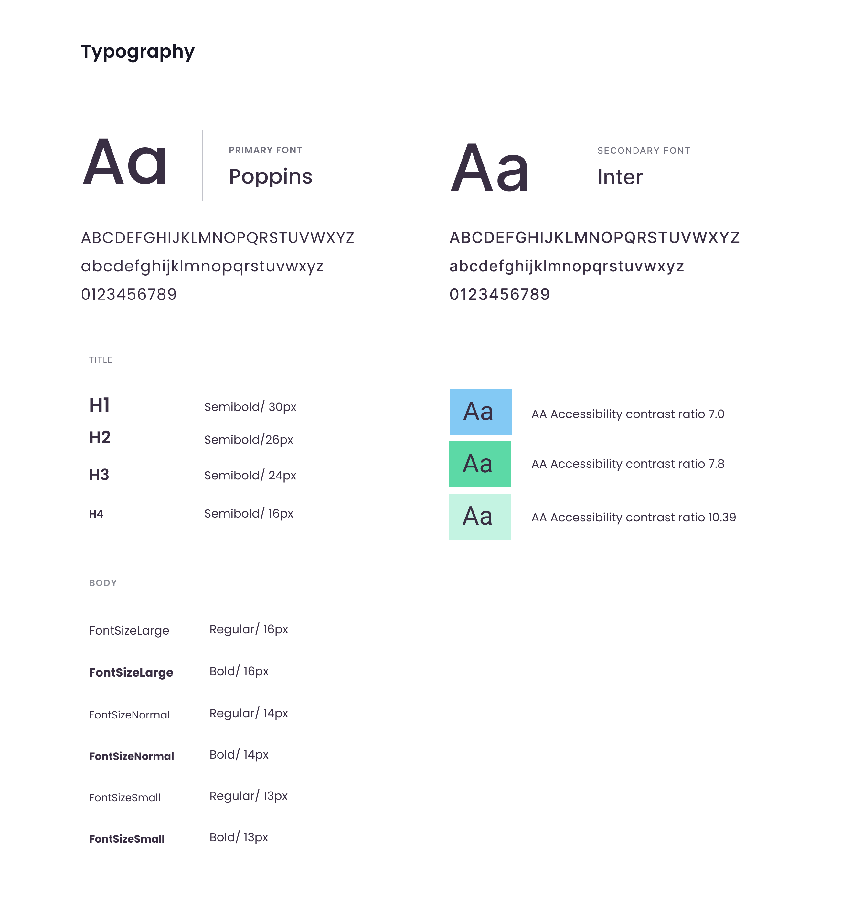

# Design systems and UI guidelines

Building a design system retroactively is a complex task. This document aims to outline our current state and where we want to move towards with building new components and refactoring old components where necessary.

QUICK LINKS

- Guidelines for implementing images [TBD]
- Guidelines for using icons [TBD]
- Guidelines for writing UI specs [TBD]

IN THIS DOC

- Design System
    - [Base System](#Base-system)
    - [Common Components](#Common-components)

 

 

### Our goals

**External:**

Memex design guide and codebase is easier to use for people that want to contribute to Memex.

**Internal:**

Memex codebase gets refactored into styled-components and StoryBook is implemented to make collaboration between designers and developers easier

Create a new approach for building new features (build the base component first), separate out all the states and logic and design layers clearly

To get our UI in a more easily testable state through the use of StoryBook, separated concerns, and automated UI testing

### Our plan

We are working on a style guide, a list of shared components and list for things we want to refactor.

We are working on a Figma component library for prototyping UI and ideas, A Figma style library and StoryBook for our React components.

Each section in this document will have a state:

- [ ]  Needs design
- [ ]  Needs documenting
- [ ]  Needs implementing in StoryBook
- [ ]  Needs implementing throughout the codebase

  

# Packages we use to help us with styling

> 🎩[styled-components](https://styled-components.com/) -  We use styled components in all new code. Progressively refactoring old components when we get the chance

> 💅[styled-components/polished](https://github.com/styled-components/polished)- Polished gives us SASS type functions for our CSS e.g. `background: ${lighten(0.2, $myThemeColor)};`

> 🥳 [styled-components/styled-icons](https://styled-icons.js.org/)

> 📗[StoryBook](https://storybook.js.org/) - StoryBook is where our living component library and UI guide will sit

 

 

# Base system

[Access the Figma library](https://www.figma.com/file/0pjfuJqvqvm60jMa4t7tBM/Memex-Pattern-Library?node-id=71%3A442)

Link to StoryBook [TBD]

Made up of tokens / variables / the key language that reflects our brand or theme.

- Typography
- Colour
- Theming
- Spacing
- Shadows
- Breakpoints
- Icon set
- Grid

## Typography

Link to StoryBook [TBD]

Font-family: 'Poppins'

*Note: Poppins font exists throughout the app but has only partially been upgraded to use the typography constants found in `/design-library`*

* Use rem
* Use constants set within design-library/typography
* Follow the colour library to make sure your text is accessible to WCAG 2.0 AA standard

- [x]  Needs design
- [x]  Needs documenting
- [ ]  Needs implementing in StoryBook
- [ ]  Needs implementing throughout the codebase

*Example*

## Colour

[Assess the Figma library](https://www.figma.com/file/0pjfuJqvqvm60jMa4t7tBM/Memex-Pattern-Library?node-id=71%3A442)

Link to StoryBook [TBD]

We have new components written with styled-components using colour constants.

## Theming

Many users have asked for a Dark theme and so when building new components account for this making sure you never hard code colour values. For an example see the Tag part of the lightTheme constant.

`export const lightTheme = {
    background: '#fff',
    tag: {
        tag: colorBlue,
        hover: colorBlue,
        selected: lighten(0.18, colorBlue),
        text: darken(0.5, desaturate(0.5, colorBlue)),
    },
}`

You can then use it in your css `background: ${props => props.theme.tag.selected};`

The app will be wrapped in a `<ThemeProvider>`

- [x]  Needs design
- [x]  Needs documenting
- [ ]  Needs implementing in StoryBook
- [ ]  Needs implementing throughout the codebase

## Spacing

We have no guidelines or consistency yet with spacing

- [ ]  Needs design
- [ ]  Needs documenting
- [ ]  Needs implementing in StoryBook
- [ ]  Needs implementing throughout the codebase

## Shadows

Link to Figma library

Link to StoryBook [TBD]

## Breakpoints

- [ ]  Define existing responsive breakpoints

## Icon Set

We don't have a consistent way of embedding icons at the stage. Some are embedded SVGs others are background images in css classes.

Let's move towards using styled-icons library.

- [x]  Install styled-icons
- [ ]  Define which styles we need for icon
- [ ]  Decide on an icon set - currently using mostly icons found in the open source [Feather Icons library](https://feathericons.com/)

## Grid

We do not have a defined grid.

## Layout

- [ ]  Define how our layout currently works
- [ ]  Define how we want it to work
- [ ]  Fix the responsive layout
- [ ]  Create a way we can use columns and row as components

 

 

# Common Components

[Access the Figma component library](https://www.figma.com/file/sQJsqiVLk6oO5f1EOgpxHt/Memex-Component-Library?node-id=0%3A1)

Link to StoryBook [TBD]

Our components exist in `common-ui/components` and you'll notice a folder called `design-library`. Components inside design-library have been through a basic refactoring to use styled-components and are now in StoryBook.
